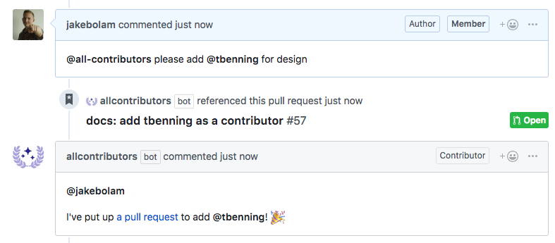

To recognise the contributions made on this repository we use the [All Contributors](https://allcontributors.org/) Bot. 
Our aim is to recognise all contributors including those that don't push code. 
Types of contribution supported by the bot include:
- Creating a new Pull Request or Issue on this repository
- Giving talks based on this repository
- Mentoring contributions to this repository
- Reviewing Pull Requests on this repository
- Reporting or working on accessibility issues related to this repository
- Providing links to podcasts, interviews, or any audio material, blogposts, tutorials, talks, videos, slides, repository, and recordings that mention this repository or mention the R Development Guide.
These links can be shared through a pull request or by opening a new issue.
- Adding content to the Wiki on this repository
- Creating logo/iconography/visual design/etc. for this project
- Organising events related to this project
- Providing financial support for this project 
- Support the infrastructure required for this project
- Help with the maintenance of this repository
- Promoting this repository and project
- Answering Questions in Issues, Slack, etc.
- Translating content of this repository
- Conducting literature review for the work on this project

# How to add Contributor(s)?

1. To add a Contributor to this repository, comment on the relevant Issue or Pull Request, asking `@all-contributors` to add a Contributor:

   ```sh
   @all-contributors please add @<github-username> for <contribution>
   ```

2. After this the bot will create a Pull Request to add the Contributor and reply to your comment with the pull request details. 


3. Once the repository Admins review and approve this Pull Request, the Contributor will be listed on the repository.

4. Multiple Contributors can also be added at the same time using a single line or multiple lines:

  - Using single line
    ```sh
    @all-contributors please add @<github-username> for <contribution>. please add @<github-username> for <contribution>.
    ```

  - Using multiple lines
    ```sh
    @all-contributors
    please add @<username> for <contribution>. 
    please add @<username> for <contribution>.
    ```

5. Multiple contributions can be included separated by comma (,):

    ```sh
   @all-contributors please add @<github-username> for <contribution-1>, <contribution-2>, <contribution-3>
   ```
   
## Note: 

- A list of valid contribution types is available on the [Emoji Key (and Contribution Types)](https://allcontributors.org/docs/en/emoji-key) page.
Replace `<contribution>` with the appropriate keyword available in the `Type` column of the [Emoji Key table](https://allcontributors.org/docs/en/emoji-key#table). 

- The bot uses [basic Natural Language Parsing](https://github.com/all-contributors/app/blob/master/lib/parse-comment.js) to determine the intent of your comment. Hence, your request to the bot doesn't need to be perfect. For example, the following will work too:
```sh
Jane you have written excellent documentation and your infrastructure work has been great too. Let's add `@jane.doe23` for her contributions. cc `@all-contributors`
```
If you precede the contributor's username with `@` as shown above, then the bot will work best in parsing the comment correctly. Otherwise, the bot may not correctly identify the user.
